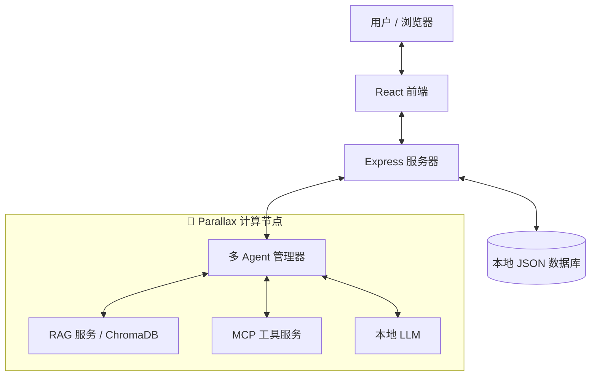
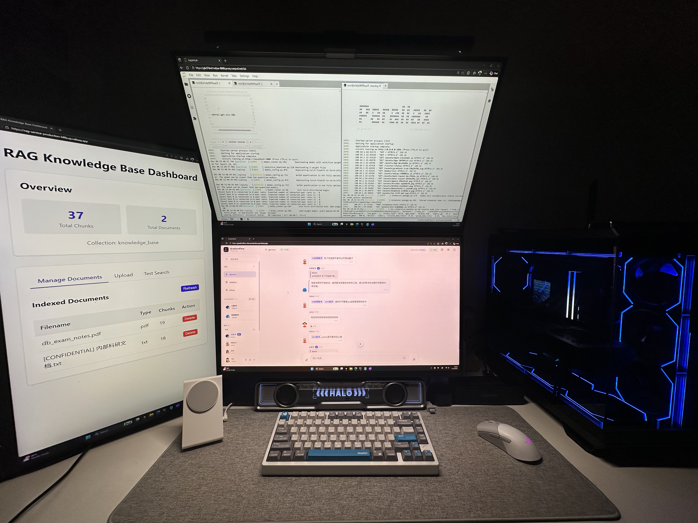

# GradientFlow


> **🏆 打造你的专属 AI 实验室 | Gradient 黑客松参赛作品**
>

[English](./README_EN.md) | [中文](./README.md) | [Hackathon Writeup (EN)](./README_HACKATHON_EN.md)

[](https://github.com/zengyuzhi/gradientflow)
[](https://github.com/GradientHQ/parallax)
[](./LICENSE)

---

## 📸 产品演示


### 🎬 视频演示

[](https://www.youtube.com/watch?v=qLfxUgM752Q)

**更多截图**: [RAG 知识库](#rag-知识库--ai-摘要) | [智能文档分析](#智能文档分析) | [Agent 配置](#agent-配置--mcp-工具)

---

## 🔗 链接

- **在线演示**: [gradientflow-chat-production.up.railway.app](https://gradientflow-chat-production.up.railway.app/)
- **小红书**: [GradientFlow](http://xhslink.com/o/1CF3tnSUnuE)
- **Parallax**: [github.com/GradientHQ/parallax](https://github.com/GradientHQ/parallax)

---

## 🎯 什么是 GradientFlow？

**GradientFlow** 是一个隐私优先、AI 原生的本地 Workspace 平台，旨在为团队和个人提供安全、智能的协作体验。由 [**Parallax**](https://github.com/GradientHQ/parallax) 驱动，它利用分布式本地计算来运行强大的 AI Agent，确保数据永远不会离开您的基础设施。

### 📖 起源故事

这个项目的灵感源于我和朋友的一次科研讨论。我们发现，大家在做科研的时候，为了同步进度和想法，不得不频繁地把自己 AI 的回答复制粘贴发到群里，这非常低效。

更令我们头疼的是，AI 之间没有**共享上下文**。特别是在跨国合作时（比如我的美国朋友），我的 AI 不知道你的 AI 刚才分析了什么，这种信息的割裂让合作变得非常痛苦。同时，我们对数据安全有着深深的担忧，不敢把未发表的科研资料和核心想法投喂给公有的 AI 模型。

**我们需要一个既能像群聊一样共享上下文，又能通过本地运行确保绝对隐私的 AI。** 这就是 GradientFlow 的诞生理由。

### 💡 我们解决的问题

| 挑战 | 云端 AI 方案 | GradientFlow + Parallax |
|------|-------------|------------------------|
| **数据隐私** | 敏感数据发送至第三方服务器 | 所有数据留在您自己的硬件上 |
| **成本** | 按 Token 计费，费用快速累积 | 部署后零推理成本 |
| **延迟** | 网络往返增加延迟 | 本地推理 = 即时响应 |
| **控制权** | 供应商锁定，模型下线风险 | 您拥有模型和基础设施 |
| **上下文理解** | 每次对话都是独立的，缺乏连贯性 | 精细的 Context Engineering，理解对话历史、@提及和引用关系 |
| **交互模式** | 传统 Bot 只能被动回答问题 | Agent 可主动参与讨论、筛选相关信息、适时插入观点 |

---

## 🔌 Parallax 深度集成

[**Parallax**](https://github.com/GradientHQ/parallax) 是 GradientFlow 的 AI 核心引擎。我们不只是调用 API，而是将 Parallax 深度嵌入到整个架构中。

### 集成方式

| 组件 | Parallax 作用 | 技术细节 |
|------|--------------|---------|
| **多 Agent 管理器** | 在 Parallax 节点上并发运行多个 Agent | Python 服务部署于 Parallax 计算节点 |
| **RAG 知识库** | 本地向量检索，数据不外传 | ChromaDB + Parallax 本地推理 |
| **LLM 推理** | 零 Token 费用的本地模型 | 支持 Llama 3 / GPT-oss / Qwen 等 |
| **工具执行** | 网络搜索、MCP 协议等工具链 | 分布式任务调度 |

### 系统架构



### Parallax 带来的优势

-   **隐私优先**：所有聊天记录、文档和向量嵌入都存储在您自己的硬件上
-   **成本效益**：利用 Parallax 调度消费级 GPU 集群，彻底消除 Token 费用
-   **低延迟**：本地推理确保毫秒级响应
-   **可扩展性**：随时向 Parallax 集群添加更多节点

### 🖥️ 我们的硬件配置

本项目演示环境使用以下硬件配置：

| 组件 | 规格 |
|------|------|
| **GPU** | 2 × NVIDIA RTX 5080 |
| **模型** | GPT-OSS 20B |
| **推理框架** | Parallax 本地推理 |



> 💡 两张 RTX 5080 显卡足以流畅运行 20B 参数的大语言模型，展示了消费级硬件在 AI 应用中的强大潜力。

---

## ✨ 核心功能

### 🤖 智能本地 Agent `🔌 Parallax 驱动`

-   **多 Agent 系统**：支持多个 Agent 同时运行（`@AI助手`, `@Writer`, `@Researcher`），全部由 Parallax 本地 LLM 驱动
-   **Agent 选择器**：下拉菜单选择在线 Agent，支持键盘导航
-   **RAG 检索增强生成** `🔌`：上传文档至本地知识库，AI助手检索私有数据
-   **网络搜索** `🔌`：集成隐私搜索，通过 Parallax 节点执行
-   **MCP 集成** `🔌`：支持 Model Context Protocol，扩展工具能力
-   **顺序工具调用**：支持多轮工具的顺序执行
-   **最大轮次控制**：可配置 Agent 响应的最大轮次

### 💬 现代聊天体验

-   **智能上下文管理**：精细调优的 Context Engineering，AI助手能准确理解对话历史、引用关系和 @提及
-   **富文本支持**：Markdown、代码高亮
-   **交互式体验**：消息表情回应、引用回复、@提及
-   **智能摘要** `🔌`：一键生成长对话的 AI 摘要
-   **实时同步**：输入状态指示器和实时消息更新
-   **LLM 设置**：可配置 LLM 端点、模型和 API Key

### 🛡️ 安全 & 自托管

-   **完全掌控**：您拥有代码、数据和模型的所有权
-   **身份认证**：安全的 JWT 登录系统
-   **持久化存储**：所有聊天记录本地存储

---

## ⚡ 快速开始

### 前置要求
-   Node.js 18+
-   Python 3.8+
-   运行中的 Parallax 节点（或本地 GPU 环境）

---

### 第一步：配置 Parallax

GradientFlow 的 AI 能力依赖 Parallax 提供本地 LLM 推理。请先完成 Parallax 的安装和配置：

👉 **[Parallax 官方仓库](https://github.com/GradientHQ/parallax)**

请按照 Parallax 仓库中的 **Installation** 和 **Quick Start** 说明完成配置，确保您的 Parallax 节点正常运行后再继续下一步。

---

### 第二步：启动 GradientFlow 服务

完整运行需要启动 **5 个服务**，请按以下顺序启动：

**1. 克隆仓库并安装依赖**
```bash
git clone https://github.com/zengyuzhi/gradientflow.git
cd gradientflow
npm install
```

**2. 启动后端 API 服务器** (终端 1)
```bash
npm run server
```

**3. 启动 RAG 知识库服务** (终端 2)
```bash
cd agents/rag
pip install -r requirements.txt
python rag_service.py --port 4001
```

**4. 启动 MCP 研究服务** (终端 3，可选)
```bash
cd agents/mcp
pip install -r requirements.txt
python mcp_research_server.py --transport sse --port 3001
```

**5. 启动 Agent 服务** (终端 4)
```bash
cd agents
pip install -r requirements.txt
python agent_runner.py
```

**6. 启动前端开发服务器** (终端 5)
```bash
npm run dev
```

**7. 访问应用**

打开浏览器访问 `http://localhost:5173` 并使用以下测试账户登录：
- 邮箱: `root@example.com`
- 密码: `1234567890`

> **启动顺序**: 后端 → RAG 服务 → MCP 服务 (可选) → Agent 服务 → 前端

---

## 📷 更多截图

### RAG 知识库 + AI 摘要


### 智能文档分析


### Agent 配置 + MCP 工具


---

## 🧭 未来开发指引（Roadmap）

| 功能 | 描述 | 状态 |
|------|------|------|
| 多 Agent 协作聊天 | 已落地本地多 Agent 协同对话、顺序工具调用、@提及与上下文共享能力 | ✅ 完成 |
| RAG 知识库 & 智能摘要 | 本地向量检索、私有文档上传与会话摘要，全部在私有硬件上完成 | ✅ 完成 |
| WebSocket 实时通道 | 用于逐步替换 SSE 的实时通道，提升并发与状态同步体验 | 🚧 正在 |
| 多模态上传与预览 | 扩展 PDF/表格/图片等素材的上传、解析与可视化能力 | 🚧 正在 |
| 插件化工具市场（MCP/自定义工具） | 规划一键安装、启停与版本管理的工具市场，降低扩展成本 | 🧭 策划 |
| 隐私审计与合规套件 | 计划加入可配置的数据留存策略、审计日志与合规报告导出 | 🧭 策划 |

---

## 📄 开源协议

MIT License - 详见 [LICENSE](./LICENSE)

---

*Built with ❤️ for the Gradient Network Community.*

**#BuildYourOwnAILab #Parallax #GradientNetwork**
